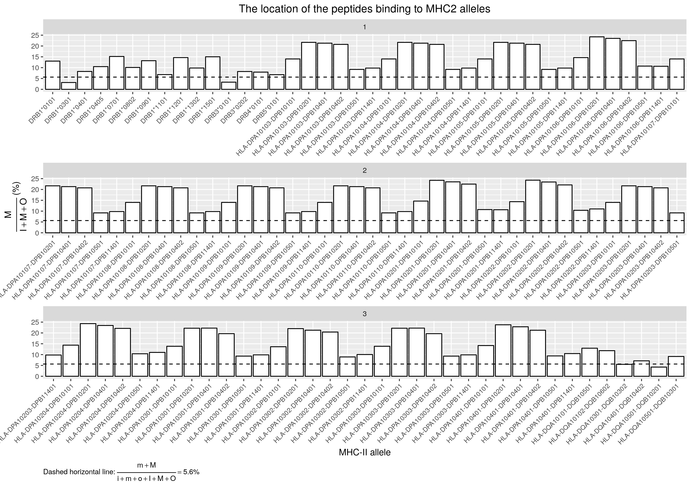
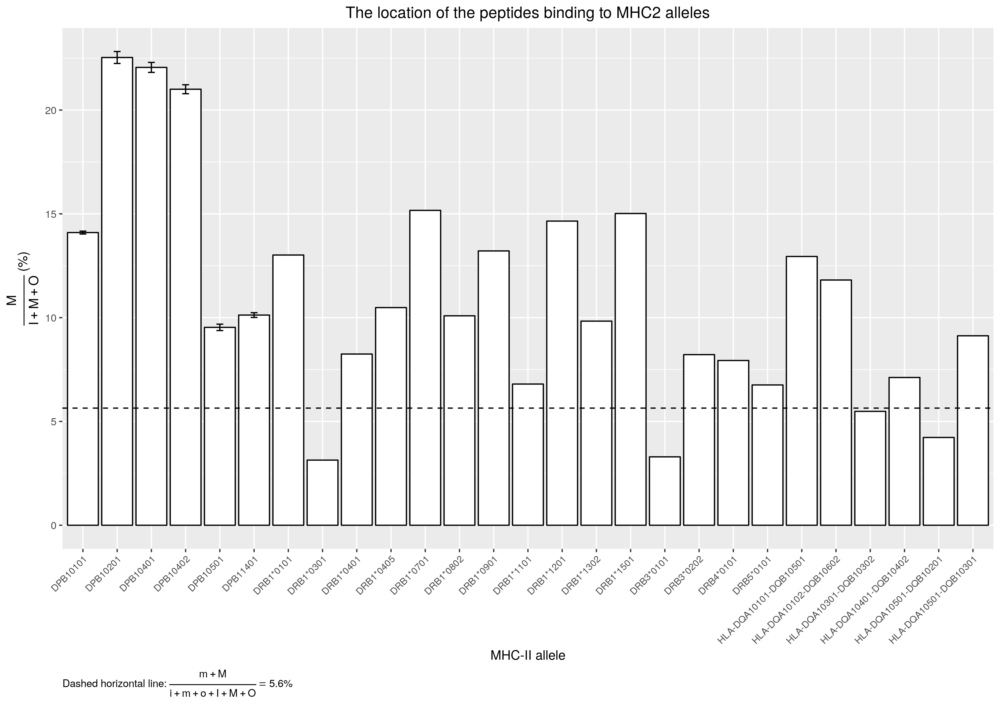

# `scripts_1`

Answers the first question of the BBBQ: how often do TMH parts of membrane
proteins bind?

## Results

All, done by [3_process_results.R](3_process_results.R):

Grouped, done by [5_process_results.R](5_process_results.R):

